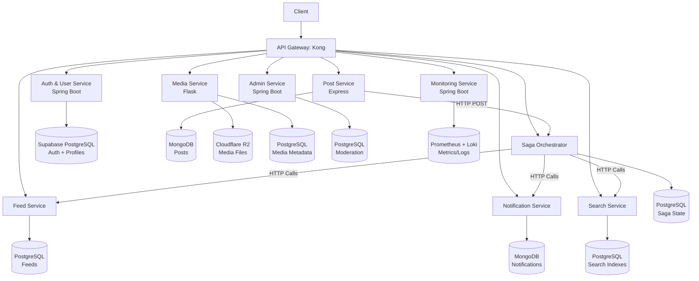

# **Technical Design Document (TDD)**

**Project Name**: Social Media Backend (Microservices)  
**Version**: 1.0  
**Author**: Chan Zhe Xiang  
**Last Updated**: 10/05/2025  
**Tech Stack**: Express (TypeScript), Flask (Python), Spring Boot (Java), Kong, Supabase (PostgreSQL), MongoDB Atlas, Cloudflare R2

---

# **1. System Architecture**

## **1.1 High-Level Overview**



---

## **1.2 Component Roles**

| **Service**                | **Framework** | **Responsibilities**                                                | **Data Store**                        | **Key Tech**                            |
| -------------------------- | ------------- | ------------------------------------------------------------------- | ------------------------------------- | --------------------------------------- |
| **API Gateway**            | Kong          | • Request routing <br> • Rate limiting <br> • JWT validation        | None                                  | Kong Plugins, OpenID Connect            |
| **Authentication Service** | Spring Boot   | • Supabase auth proxy <br> • Profile/followers management           | Supabase (PostgreSQL)                 | Supabase SDK, JWT                       |
| **User Service**           | Express       | • Profile/followers management                                      | Supabase (PostgreSQL)                 |                                         |
| **Post Service**           | Express       | • Post/comment/like CRUD                                            | MongoDB                               | Mongoose                                |
| **Feed Service**           | Flask         | • Feed generation                                                   | Supabase (PostgreSQL)                 | SQLAlchemy, psycopg2                    |
| **Notification Service**   | Express       | • Real-time WebSocket alerts <br> • Email digests                   | MongoDB                               | Socket.IO, BullMQ                       |
| **Media Service**          | Flask         | • Image uploads/thumbnails <br> • Signed URL generation             | Cloudflare R2 + Supabase (PostgreSQL) | Pillow, boto3                           |
| **Search Service**         | Flask         | • Full-text search <br> • Hashtag indexing                          | Supabase (PostgreSQL)                 | PostgreSQL FTS, pg_trgm                 |
| **Admin Service**          | Spring Boot   | • Content/user moderation <br> • Audit logging                      | Supabase (PostgreSQL)                 | Spring Data JPA, Hibernate Envers       |
| **Saga Orchestrator**      | Spring Boot   | • Distributed transaction coordination <br> • Compensation handling | Supabase (PostgreSQL)                 | Spring WebClient, `@Retryable` (Spring) |
| **Monitoring Service**     | Spring Boot   | • Health checks <br> • Centralized logging                          | Prometheus + Loki                     | Micrometer, Grafana                     |

---

## **1.3 Data Flow**

#### **Critical Path: Post Creation with Image**

1. **Client** → `POST /posts` (via Kong with JWT + image)
2. **Post Service** → Saves draft to MongoDB → Calls **Saga Orchestrator** via HTTP
3. **Saga Orchestrator** sequentially:
    - HTTP → **Media Service**: Upload image to R2
    - HTTP → **Feed Service**: Add post to followers’ feeds
    - HTTP → **Search Service**: Index post content
    - HTTP → **Notification Service**: Alert followers
4. **On Success**: Post marked as published
5. **On Failure**:
    - Saga triggers compensation:
        - Delete draft post (Post Service)
        - Delete uploaded image (Media Service)
        - Remove from search index (Search Service)
    - Returns `5xx` with rollback details

---

## **1.4 Technology Justifications**

| **Technology**     | **Alternatives Considered**    | **Why Chosen**                                                                                                                                                                            |
| ------------------ | ------------------------------ | ----------------------------------------------------------------------------------------------------------------------------------------------------------------------------------------- |
| **Supabase Auth**  | Firebase Auth                  | • Free tier suitable for portfolio <br> • Native integration with PostgreSQL/Supabase (no additional database) <br> • Self-hostable option for future scaling                             |
| **Cloudflare R2**  | AWS S3                         | • Zero egress fees (critical for media-heavy apps) <br> • S3-compatible API (easy migration to AWS if needed) <br> • Generous free tier (10GB storage, 1M ops/month)                      |
| **PostgreSQL FTS** | Elasticsearch                  | • Built into PostgreSQL (no extra infrastructure) <br> • Good enough for small-scale search (supports hashtags/user search) <br> • Simpler maintenance (no separate cluster)              |
| **BullMQ**         | RabbitMQ, Kafka                | • Redis-based (lighter than RabbitMQ) <br> • Uses Redis internally (no separate setup) <br> • Built-in retries/rate limiting for notifications <br> • Simple API (good for Express.js)    |
| **HTTP Sagas**     | Spring State Machine, RabbitMQ | • Minimal complexity (direct HTTP calls) but less resilient to service downtime <br> • Leverages Spring Boot’s `@Retryable` for resilience <br> • No need for event broker infrastructure |

---

# **2. API Specifications**

## **2.1 API Gateway (Kong)**

**Base URL**: `https://api.yoursocialapp.com`

### **Global Configuration**

```yaml
# kong.yml (Declarative Configuration)
services:
    - name: auth-service
      url: http://auth-service:8080
      routes:
          - paths: ["/auth", "/users"]
            methods: [GET, POST, PUT, DELETE]

    - name: post-service
      url: http://post-service:3000
      routes:
          - paths: ["/posts", "/posts/*/comments", "/posts/*/likes"]
            methods: [GET, POST, PUT, DELETE]

    # Repeat for all other services...
```

### **Key Routes & Policies**

| **Route**           | **Upstream Service**   | **Policies**                                                     |
| ------------------- | ---------------------- | ---------------------------------------------------------------- |
| `POST /auth/*`      | Authentication Service | • Rate limiting (5 req/min) <br> • CORS                          |
| `GET /users/*`      | User Service           | • JWT validation <br> • Role-based access (RBAC)                 |
| `POST /posts`       | Post Service           | • JWT validation <br> • Payload size limit (10MB)                |
| `GET /feed`         | Feed Service           | • JWT validation <br> • Cache-control headers                    |
| `DELETE /admin/*`   | Admin Service          | • JWT validation <br> • IP whitelisting (internal admin UI only) |
| `WS /notifications` | Notification Service   | • JWT validation (WebSocket upgrade)                             |

### **Error Response Example**

```json
{
    "error": "RateLimitExceeded",
    "message": "Too many requests (5/min allowed)",
    "status_code": 429
}
```

---

## **2.2 Authentication Service (Spring Boot)**

**Base Path**: `/auth` (authentication)

### **2.2.1 Authentication Endpoints**

#### **1. Register User**

`POST /auth/register`  
**Description**: Email/password signup with Supabase Auth + profile initialization

**Request**:

```json
{
    "email": "user@example.com",
    "password": "SecurePass123!",
    "username": "dev_user"
}
```

**Response**: `201 Created`

```json
{
    "id": "user_123",
    "email": "user@example.com",
    "access_token": "sbp_...",
    "username": "dev_user"
}
```

**Validation**:

-   Password: 8+ chars, 1 uppercase, 1 symbol
-   Email: Valid format + unique
-   Username: 3-20 chars, alphanumeric

---

#### **2. Login User**

`POST /auth/login`  
**Description**: Supabase email/password authentication

**Request**:

```json
{
    "email": "user@example.com",
    "password": "SecurePass123!"
}
```

**Response**: `200 OK`

```json
{
    "access_token": "sbp_...",
    "expires_in": 3600,
    "user_id": "user_123"
}
```

**Security**:

-   Rate limited: 5 attempts/min
-   Lockout after 5 failed attempts

#### **3. Refresh Token**

`POST /auth/refresh`  
**Description**: Get new access token using refresh token

**Request**:

```json
{
    "refresh_token": "sbp_..."
}
```

**Response**: `200 OK`

```json
{
    "access_token": "sbp_...",
    "expires_in": 3600
}
```

**Errors**:

-   `401 Unauthorized` if refresh token is invalid/expired

---

#### **4. Logout**

`POST /auth/logout`  
**Description**: Invalidate all refresh tokens for the user

**Headers**:

```
Authorization: Bearer <JWT>
```

**Response**: `204 No Content`

**Implementation**:

-   Calls Supabase's `POST /auth/v1/logout` internally
-   Deletes all refresh tokens from `auth.refresh_tokens`

---

### **2.2.2 Database Schema**

#### **Supabase-Managed Tables**

```sql
-- auth.users (managed by Supabase)
-- auth.refresh_tokens (managed by Supabase)
```

---

## **2.3 User Service (Express)**

**Base Path**: `/users` (profiles), `/follows` (relationships)

### **2.3.1 Profile Endpoints**

#### **1. Get Profile**

`GET /users/{user_id}`  
**Description**: Public profile data

**Response**: `200 OK`

```json
{
    "id": "user_123",
    "username": "dev_user",
    "avatar_url": "https://r2.com/avatars/user_123.jpg",
    "bio": "Backend developer",
    "follower_count": 42,
    "following_count": 7
}
```

---

#### **2. Update Profile**

`PUT /users/me`  
**Headers**: `Authorization: Bearer <JWT>`

**Request**:

```json
{
    "bio": "Updated bio",
    "avatar_url": "https://r2.com/new_avatar.jpg"
}
```

**Response**: `200 OK` (updated profile)

---

#### **3. Delete Account**

`DELETE /users/me`  
**Description**: Initiate account deletion (Saga-driven)

**Headers**:

```
Authorization: Bearer <JWT>
```

**Response**: `202 Accepted`

```json
{
    "saga_id": "saga_123",
    "message": "Account deletion in progress"
}
```

**Saga Flow**:

1. Marks user as `pending_deletion` in `user_profiles`
2. Triggers:
    - Post deletion (Post Service)
    - Media cleanup (Media Service)
    - Supabase account deletion
3. On completion: Hard-deletes profile

---

### **2.3.2 Follow Endpoints**

#### **1. Follow User**

`POST /follows/{target_user_id}`  
**Headers**: `Authorization: Bearer <JWT>`

**Response**: `201 Created`

```json
{
    "follower_id": "user_456",
    "followee_id": "user_123",
    "relationship": "FOLLOWING"
}
```

---

#### **2. Unfollow User**

`DELETE /follows/{target_user_id}`  
**Headers**: `Authorization: Bearer <JWT>`

**Response**: `204 No Content`

---

### **2.3.3 Database Schema**

#### **PostgreSQL Tables**

```sql
-- Profiles
CREATE TABLE public.user_profiles (
  id UUID PRIMARY KEY REFERENCES auth.users(id) ON DELETE CASCADE,
  username TEXT UNIQUE NOT NULL,
  avatar_url TEXT,
  bio TEXT,
  follower_count INT DEFAULT 0 CHECK (follower_count >= 0),
  following_count INT DEFAULT 0 CHECK (following_count >= 0),
  created_at TIMESTAMPTZ DEFAULT NOW()
);

-- Follows
CREATE TABLE public.follows (
  follower_id UUID NOT NULL REFERENCES public.user_profiles(id) ON DELETE CASCADE,
  followee_id UUID NOT NULL REFERENCES public.user_profiles(id) ON DELETE CASCADE,
  created_at TIMESTAMPTZ DEFAULT NOW(),
  PRIMARY KEY (follower_id, followee_id),
  CONSTRAINT no_self_follow CHECK (follower_id <> followee_id)
);

-- Indexes
CREATE INDEX idx_followers ON public.follows(followee_id);
CREATE INDEX idx_following ON public.follows(follower_id);
```

#### **Row-Level Security (RLS)**

```sql
-- Profiles
CREATE POLICY "Public read access" ON public.user_profiles
  FOR SELECT USING (true);

CREATE POLICY "User can update own profile" ON public.user_profiles
  FOR UPDATE USING (id = auth.uid());

-- Follows
CREATE POLICY "User can manage own follows" ON public.follows
  FOR ALL USING (follower_id = auth.uid());
```

---

## **2.4 Post Service (Express)**

**Base Path**: `/posts`

### **2.3.1 Post Endpoints**

#### **1. Create Post**

`POST /posts`  
**Description**: Create a new text or image post  
**Headers**:

```
Authorization: Bearer <JWT>
Content-Type: multipart/form-data
```

**Request**:

-   `content` (string, required, max 500 chars)
-   `image` (file, optional, max 10MB)

**Success Response**: `201 Created`

```json
{
    "id": "post_123",
    "author_id": "user_456",
    "content": "Hello world! #intro",
    "image_url": "https://r2.com/posts/post_123.jpg",
    "hashtags": ["intro"],
    "created_at": "2023-11-20T12:00:00Z"
}
```

**Errors**:  
| Code | Error | Response Example |  
|------|---------------------|------------------------------------------|  
| `400` | EmptyContent | `{"error": "EmptyContent", "message": "Post content cannot be empty"}` |  
| `413` | FileTooLarge | `{"error": "FileTooLarge", "message": "Max image size is 10MB"}` |  
| `415` | InvalidImageFormat | `{"error": "InvalidImageFormat", "message": "Only JPEG/PNG allowed"}` |

---

#### **2. Get Post**

`GET /posts/{post_id}`  
**Description**: Retrieve a single post by ID

**Success Response**: `200 OK`

```json
{
    "id": "post_123",
    "author_id": "user_456",
    "content": "Hello world!",
    "image_url": "https://r2.com/posts/post_123.jpg",
    "like_count": 42,
    "comment_count": 5,
    "created_at": "2023-11-20T12:00:00Z"
}
```

**Errors**:  
| Code | Error | Response Example |  
|------|---------------|------------------------------------------|  
| `404` | PostNotFound | `{"error": "PostNotFound", "message": "Post not found"}` |

---

#### **3. Update Post**

`PUT /posts/{post_id}`  
**Description**: Update post content (author only)  
**Headers**: `Authorization: Bearer <JWT>`  
**Request**:

```json
{
    "content": "Updated content"
}
```

**Success Response**: `200 OK`

```json
{
    "id": "post_123",
    "content": "Updated content",
    "updated_at": "2023-11-20T12:30:00Z"
}
```

**Errors**:  
| Code | Error | Response Example |  
|------|------------------|------------------------------------------|  
| `403` | NotPostAuthor | `{"error": "NotPostAuthor", "message": "Only the author can edit this post"}` |  
| `404` | PostNotFound | `{"error": "PostNotFound", "message": "Post not found"}` |

---

#### **4. Delete Post**

`DELETE /posts/{post_id}`  
**Description**: Soft-delete a post (author or admin only)  
**Headers**: `Authorization: Bearer <JWT>`

**Success Response**: `204 No Content`

**Errors**:  
| Code | Error | Response Example |  
|------|------------------|------------------------------------------|  
| `403` | NotAuthorOrAdmin | `{"error": "NotAuthorOrAdmin", "message": "Requires post author or admin role"}` |

---

### **2.3.2 Comment Endpoints**

#### **1. Add Comment**

`POST /posts/{post_id}/comments`  
**Description**: Add a comment to a post  
**Headers**: `Authorization: Bearer <JWT>`  
**Request**:

```json
{
    "text": "Great post!"
}
```

**Success Response**: `201 Created`

```json
{
    "id": "comment_789",
    "post_id": "post_123",
    "author_id": "user_456",
    "text": "Great post!",
    "created_at": "2023-11-20T12:05:00Z"
}
```

**Errors**:  
| Code | Error | Response Example |  
|------|----------------|------------------------------------------|  
| `400` | EmptyComment | `{"error": "EmptyComment", "message": "Comment text cannot be empty"}` |  
| `404` | PostNotFound | `{"error": "PostNotFound", "message": "Cannot comment on deleted post"}` |

---

#### **2. List Comments**

`GET /posts/{post_id}/comments`  
**Description**: Get paginated comments for a post

**Query Params**:

-   `?limit=10` (default: 20)
-   `?cursor=last_comment_id`

**Success Response**: `200 OK`

```json
{
    "comments": [
        {
            "id": "comment_789",
            "author_id": "user_456",
            "text": "Great post!",
            "created_at": "2023-11-20T12:05:00Z"
        }
    ],
    "next_cursor": "comment_789"
}
```

**Errors**:  
| Code | Error | Response Example |  
|------|---------------|------------------------------------------|  
| `404` | PostNotFound | `{"error": "PostNotFound", "message": "Post not found"}` |

---

#### **3. Delete Comment**

`DELETE /posts/{post_id}/comments/{comment_id}`  
**Description**: Delete a comment (author or admin only)  
**Headers**: `Authorization: Bearer <JWT>`

**Success Response**: `204 No Content`

**Errors**:  
| Code | Error | Response Example |  
|------|------------------|------------------------------------------|  
| `403` | NotAuthorOrAdmin | `{"error": "NotAuthorOrAdmin", "message": "Requires comment author or admin role"}` |

---

### **2.3.3 Like Endpoints**

#### **1. Like Post**

`POST /posts/{post_id}/likes`  
**Description**: Like a post  
**Headers**: `Authorization: Bearer <JWT>`

**Success Response**: `200 OK`

```json
{
    "post_id": "post_123",
    "user_id": "user_456",
    "like_count": 43
}
```

**Errors**:  
| Code | Error | Response Example |  
|------|----------------|------------------------------------------|  
| `409` | AlreadyLiked | `{"error": "AlreadyLiked", "message": "User already liked this post"}` |

---

#### **2. Unlike Post**

`DELETE /posts/{post_id}/likes`  
**Description**: Remove a like  
**Headers**: `Authorization: Bearer <JWT>`

**Success Response**: `200 OK`

```json
{
    "post_id": "post_123",
    "user_id": "user_456",
    "like_count": 42
}
```

**Errors**:  
| Code | Error | Response Example |  
|------|--------------|------------------------------------------|  
| `404` | LikeNotFound | `{"error": "LikeNotFound", "message": "Like not found"}` |

---

#### **3. List Likes**

`GET /posts/{post_id}/likes`  
**Description**: Get users who liked a post

**Query Params**:

-   `?limit=10` (default: 20)

**Success Response**: `200 OK`

```json
{
    "likes": [
        {
            "user_id": "user_456",
            "username": "dev_user",
            "avatar_url": "https://r2.com/avatars/user_456.jpg",
            "liked_at": "2023-11-20T12:01:00Z"
        }
    ]
}
```

**Errors**:  
| Code | Error | Response Example |  
|------|---------------|------------------------------------------|  
| `404` | PostNotFound | `{"error": "PostNotFound", "message": "Post not found"}` |

---

### **2.3.4 Database Schema**

#### **Posts Collection (MongoDB)**

```javascript
{
  _id: ObjectId("post_123"),
  author_id: "user_456",  // Reference to Supabase user
  content: "Hello world! #intro",
  hashtags: ["intro"],
  image_key: "posts/post_123.jpg",  // R2 object key
  status: "PUBLISHED",  // or "DELETED"
  like_count: Number,
  comment_count: Number,
  created_at: ISODate("2023-11-20T12:00:00Z"),
  updated_at: ISODate("2023-11-20T12:00:00Z")
}
```

#### **Comments Collection**

```javascript
{
  _id: ObjectId("comment_789"),
  post_id: ObjectId("post_123"),
  author_id: "user_456",
  text: "Great post!",
  created_at: ISODate("2023-11-20T12:05:00Z")
}
```

#### **Likes Collection**

```javascript
{
  post_id: ObjectId("post_123"),
  user_id: "user_456",
  created_at: ISODate("2023-11-20T12:01:00Z"),
  // Compound index on (post_id + user_id)
}
```

---

## **2.5 Feed Service (Flask)**

**Base Path**: `/feed`

### **2.4.1 Feed Endpoints**

#### **1. Get Personalized Feed**

`GET /feed`  
**Description**: Returns a paginated feed of posts from followed users (chronological order)  
**Headers**: `Authorization: Bearer <JWT>`

**Query Params**:

-   `?limit=20` (default: 20, max: 50)
-   `?cursor=2023-11-19T00:00:00Z` (ISO timestamp for pagination)

**Success Response**: `200 OK`

```json
{
    "feed": [
        {
            "id": "post_123",
            "author_id": "user_456",
            "content": "Hello world!",
            "image_url": "https://r2.com/posts/post_123.jpg",
            "like_count": 42,
            "comment_count": 5,
            "created_at": "2023-11-20T12:00:00Z"
        }
    ],
    "next_cursor": "2023-11-19T00:00:00Z"
}
```

**Errors**:  
| Code | Error | Response Example |  
|------|---------------|------------------------------------------|  
| `401` | Unauthorized | `{"error": "Unauthorized", "message": "Missing/invalid JWT"}` |
| `500` | ServerError | If database fails |

---

#### **2. Get Explore Feed**

`GET /feed/explore`  
**Description**: Returns recent posts + trending hashtags in a single response

**Query Params**:

-   `?post_limit=20` (default: 20, max: 50)
-   `?hashtag_limit=5` (default: 5, max: 10)
-   `?cursor=post_123` (post ID for pagination)

**Success Response**: `200 OK`

```json
{
    "posts": [
        {
            "id": "post_789",
            "author_id": "user_999",
            "content": "Check this out! #backend",
            "image_url": "https://r2.com/posts/post_789.jpg",
            "like_count": 100,
            "created_at": "2023-11-21T08:00:00Z",
            "hashtags": ["backend"]
        }
    ],
    "trending_hashtags": [
        {
            "name": "backend",
            "post_count": 42,
            "sample_posts": ["post_789", "post_456"]
        }
    ],
    "next_cursor": "post_789"
}
```

**Errors**:  
| Code | Error | Condition |
| ----- | ------------ | ---------------------------------------- |
| `400` | InvalidLimit | If post_limit > 50 or hashtag_limit > 10 |
| `500` | ServerError | If database fails |

---

### **2.4.2 Database Schema**

#### **PostgreSQL Tables**

```sql
-- Feed denormalized data (optimized for reads)
CREATE TABLE feed_cache (
  user_id UUID NOT NULL,  -- The viewer's user ID
  post_id UUID NOT NULL REFERENCES posts(id),
  author_id UUID NOT NULL,
  content TEXT NOT NULL,
  image_url TEXT,
  like_count INT DEFAULT 0,
  comment_count INT DEFAULT 0,
  created_at TIMESTAMPTZ NOT NULL,
  PRIMARY KEY (user_id, post_id)
);

-- Hashtag trends
CREATE TABLE hashtags (
  name VARCHAR(50) PRIMARY KEY,
  post_count INT DEFAULT 1,
  last_used_at TIMESTAMPTZ DEFAULT NOW()
);

-- Indexes
CREATE INDEX idx_feed_user ON feed_cache(user_id, created_at DESC);
CREATE INDEX idx_hashtag_trends ON hashtags(post_count DESC, last_used_at DESC);
```

---

### **Error Handling**

All endpoints return:

-   `500 ServerError` if database fails
-   `429 TooManyRequests` if rate-limited by Kong

---

## **2.6 Notification Service (Express)**

**Base Path**: `/notifications`

### **2.5.1 WebSocket Connection**

**Endpoint**: `wss://api.yoursocialapp.com/notifications`  
**Description**: Real-time notification stream  
**Protocol**: WebSocket  
**Authentication**: JWT in connection header

**Message Types**:

```typescript
interface Notification {
    type: "like" | "comment" | "follow";
    id: string;
    actor_id: string;
    post_id?: string; // For like/comment
    created_at: string;
}
```

**Example Flow**:

1. Client connects with JWT
2. Server sends ping every 30s to keep alive
3. On new like:
    ```json
    {
        "type": "like",
        "id": "notif_123",
        "actor_id": "user_789",
        "post_id": "post_456",
        "created_at": "2023-11-22T09:00:00Z"
    }
    ```

---

### **2.5.2 HTTP Endpoints**

#### **1. List Notifications**

`GET /notifications`  
**Description**: Get paginated notifications  
**Headers**: `Authorization: Bearer <JWT>`

**Query Params**:

-   `?limit=20` (default: 20, max: 50)
-   `?cursor=notif_123` (for pagination)
-   `?unread=true` (filter unread only)

**Success Response**: `200 OK`

```json
{
    "notifications": [
        {
            "id": "notif_123",
            "type": "like",
            "actor_id": "user_789",
            "actor_username": "cool_user",
            "actor_avatar": "https://r2.com/avatars/user_789.jpg",
            "post_id": "post_456",
            "is_read": false,
            "created_at": "2023-11-22T09:00:00Z"
        }
    ],
    "next_cursor": "notif_123"
}
```

**Errors**:  
| Code | Error | Response Example |  
|------|---------------|------------------------------------------|  
| `401` | Unauthorized | `{"error": "Unauthorized", "message": "Invalid JWT"}` |

---

#### **2. Mark as Read**

`PUT /notifications/{notification_id}/read`  
**Description**: Mark a notification as read  
**Headers**: `Authorization: Bearer <JWT>`

**Success Response**: `204 No Content`

**Errors**:  
| Code | Error | Response Example |  
|------|---------------|------------------------------------------|  
| `404` | NotFound | `{"error": "NotFound", "message": "Notification not found"}` |

---

#### **3. Delete Notification**

`DELETE /notifications/{notification_id}`  
**Description**: Remove a notification  
**Headers**: `Authorization: Bearer <JWT>`

**Success Response**: `204 No Content`

---

### **2.5.3 Database Schema**

#### **MongoDB Collections**

**Notifications Collection**:

```javascript
{
  _id: ObjectId("notif_123"),
  user_id: "user_456",  // Recipient
  type: "like",         // "like"|"comment"|"follow"
  actor_id: "user_789", // Who triggered it
  post_id: "post_456",  // Optional
  is_read: false,
  created_at: ISODate("2023-11-22T09:00:00Z"),
  // Indexes:
  // - { user_id: 1, created_at: -1 }
  // - { user_id: 1, is_read: 1 }
}
```

**Email Queue (BullMQ Jobs)**:

```javascript
{
  jobId: "email_123",
  data: {
    type: "daily_digest",
    user_id: "user_456",
    last_notification_id: "notif_123"
  },
  opts: {
    attempts: 3,
    backoff: 5000
  }
}
```

---

## **2.7 Media Service (Flask)**

**Base Path**: `/media`

### **2.6.1 Media Endpoints**

#### **1. Upload Media**

`POST /media/upload`  
**Description**: Upload an image for posts/profiles  
**Headers**:

```
Authorization: Bearer <JWT>
Content-Type: multipart/form-data
```

**Request**:

-   `file` (required, JPEG/PNG, max 10MB)
-   `type` (required, "post"|"profile")

**Success Response**: `201 Created`

```json
{
    "id": "media_123",
    "url": "https://r2.com/media/user_456/profile.jpg",
    "thumbnail_url": "https://r2.com/media/user_456/profile_300x300.jpg",
    "width": 800,
    "height": 600,
    "mime_type": "image/jpeg"
}
```

**Errors**:  
| Code | Error | Response Example |  
|------|---------------------|------------------------------------------|  
| `400` | InvalidMediaType | `{"error": "InvalidMediaType", "message": "Type must be 'post' or 'profile'"}` |  
| `413` | FileTooLarge | `{"error": "FileTooLarge", "message": "Max file size is 10MB"}` |  
| `415` | UnsupportedFormat | `{"error": "UnsupportedFormat", "message": "Only JPEG/PNG allowed"}` |

---

#### **2. Get Media Metadata**

`GET /media/{media_id}`  
**Description**: Fetch media details

**Success Response**: `200 OK`

```json
{
    "id": "media_123",
    "owner_id": "user_456",
    "url": "https://r2.com/media/user_456/profile.jpg",
    "type": "profile",
    "uploaded_at": "2023-11-22T10:00:00Z"
}
```

**Errors**:  
| Code | Error | Response Example |  
|------|---------------|------------------------------------------|  
| `404` | MediaNotFound | `{"error": "MediaNotFound", "message": "Media not found"}` |

---

#### **3. Delete Media**

`DELETE /media/{media_id}`  
**Description**: Remove media (owner or admin only)  
**Headers**: `Authorization: Bearer <JWT>`

**Success Response**: `204 No Content`

**Errors**:  
| Code | Error | Response Example |  
|------|------------------|------------------------------------------|  
| `403` | Forbidden | `{"error": "Forbidden", "message": "Not media owner"}` |

---

### **2.6.2 Database Schema**

#### **PostgreSQL Tables**

```sql
CREATE TABLE media (
  id UUID PRIMARY KEY,
  user_id UUID NOT NULL REFERENCES auth.users(id) ON DELETE CASCADE,
  r2_key VARCHAR(255) NOT NULL,  -- e.g. "user_456/profile.jpg"
  type VARCHAR(10) NOT NULL CHECK (type IN ('post', 'profile')),
  mime_type VARCHAR(100) NOT NULL,
  width INT,
  height INT,
  created_at TIMESTAMPTZ DEFAULT NOW()
);

-- Thumbnail references
CREATE TABLE media_thumbnails (
  media_id UUID NOT NULL REFERENCES media(id) ON DELETE CASCADE,
  size VARCHAR(20) NOT NULL CHECK (size IN ('300x300', '100x100')),
  r2_key VARCHAR(255) NOT NULL,
  PRIMARY KEY (media_id, size)
);
```

---

### **2.6.3 Processing Pipeline**

1. **Upload Flow**:

    - Validate file → Generate UUID → Store in R2 (`user_{id}/{uuid}.jpg`)
    - Create 300x300 thumbnail using Pillow
    - Record metadata in PostgreSQL

2. **Deletion Flow**:
    - Soft-delete with R2 object lifecycle rules (actual deletion after 30 days)
    - Immediate metadata removal

---

### **2.6.4 Cloudflare R2 Structure**

```
media/
  ├── user_456/
  │   ├── profile.jpg           (original)
  │   └── profile_300x300.jpg   (thumbnail)
  └── post_789/
      ├── image.jpg
      └── image_300x300.jpg
```

---

## **2.8 Search Service (Flask)**

**Base Path**: `/search`

### **2.8.1 Search Endpoints**

#### **1. Search Posts**

`GET /search/posts`  
**Description**: Full-text search across post content and hashtags  
**Query Params**:

-   `q` (required): Search query
-   `limit=20` (default: 20, max: 50)
-   `cursor=post_123` (for pagination)

**Success Response**: `200 OK`

```json
{
    "results": [
        {
            "id": "post_789",
            "author_id": "user_456",
            "content": "Check out this #backend tutorial",
            "hashtags": ["backend", "tutorial"],
            "like_count": 42,
            "created_at": "2023-11-23T08:00:00Z"
        }
    ],
    "next_cursor": "post_789"
}
```

**Errors**:  
| Code | Error | Response Example |  
|------|---------------|------------------------------------------|  
| `400` | MissingQuery | `{"error": "MissingQuery", "message": "Search term required"}` |

---

#### **2. Search Users**

`GET /search/users`  
**Description**: Find users by username or bio  
**Query Params**:

-   `q` (required): Search query
-   `limit=20` (default: 20, max: 50)

**Success Response**: `200 OK`

```json
{
    "results": [
        {
            "id": "user_789",
            "username": "dev_guru",
            "avatar_url": "https://r2.com/avatars/user_789.jpg",
            "bio": "Backend engineer specializing in microservices"
        }
    ]
}
```

---

#### **3. Search Hashtags**

`GET /search/hashtags`  
**Description**: Find hashtags with post counts  
**Query Params**:

-   `prefix=back` (optional prefix filter)

**Success Response**: `200 OK`

```json
{
    "results": [
        {
            "name": "backend",
            "post_count": 125,
            "recent_post_ids": ["post_123", "post_456"]
        }
    ]
}
```

---

### **2.8.2 Database Schema**

#### **PostgreSQL Tables**

```sql
-- Post search index
CREATE TABLE post_search (
  post_id UUID PRIMARY KEY REFERENCES posts(id),
  content_tsvector TSVECTOR,  -- Full-text indexed content
  hashtags TEXT[]             -- Array of hashtags
);

-- User search index
CREATE TABLE user_search (
  user_id UUID PRIMARY KEY REFERENCES user_profiles(id),
  username_trgm TEXT,        -- For fuzzy matching
  bio_tsvector TSVECTOR
);

-- Hashtag stats (materialized view)
CREATE MATERIALIZED VIEW hashtag_stats AS
SELECT
  lower(hashtag) AS name,
  COUNT(*) AS post_count,
  array_agg(post_id ORDER BY created_at DESC LIMIT 5) AS recent_post_ids
FROM (
  SELECT unnest(hashtags) AS hashtag, id AS post_id, created_at
  FROM posts
) expanded
GROUP BY lower(hashtag);
```

---

### **Indexing Strategy**

1. **Post Content**:

    ```sql
    UPDATE post_search
    SET content_tsvector = to_tsvector('english', posts.content)
    FROM posts
    WHERE post_search.post_id = posts.id;
    ```

2. **User Bio**:

    ```sql
    CREATE INDEX idx_user_username ON user_search USING GIN(username_trgm gin_trgm_ops);
    ```

3. **Real-time Updates**:
    ```python
    # Pseudocode - Trigger after post creation
    def update_search_index(post_id):
        post = get_post(post_id)
        db.execute("""
            INSERT INTO post_search (post_id, content_tsvector, hashtags)
            VALUES (%s, to_tsvector('english', %s), %s)
            ON CONFLICT (post_id) DO UPDATE
            SET content_tsvector = EXCLUDED.content_tsvector,
                hashtags = EXCLUDED.hashtags
        """, (post.id, post.content, post.hashtags))
    ```

---

### **Query Examples**

1. **Fuzzy Username Search**:

    ```sql
    SELECT * FROM user_search
    WHERE username_trgm % 'devgr'  -- Matches "dev_guru"
    ORDER BY similarity(username_trgm, 'devgr') DESC;
    ```

2. **Hashtag Autocomplete**:
    ```sql
    SELECT * FROM hashtag_stats
    WHERE name LIKE 'back%'
    ORDER BY post_count DESC;
    ```

---

## **2.9 Admin Service (Spring Boot)**

**Base Path**: `/admin`  
**Required Role**: `ADMIN` (validated via JWT)

### **2.9.1 User Moderation Endpoints**

#### **1. List Reported Users**

`GET /admin/users/reported`  
**Description**: Get paginated list of users with active reports  
**Query Params**:

-   `limit=20` (default: 20, max: 100)
-   `resolved=false` (filter unresolved reports)

**Success Response**: `200 OK`

```json
{
    "reports": [
        {
            "report_id": "report_123",
            "user_id": "user_789",
            "username": "problem_user",
            "reason": "spam",
            "reporter_id": "user_456",
            "created_at": "2023-11-24T09:00:00Z"
        }
    ],
    "next_cursor": "report_123"
}
```

**Errors**:  
| Code | Error | Response Example |  
|------|---------------|------------------------------------------|  
| `401` | Unauthorized | `{"error": "Unauthorized", "message": "Invalid JWT"}` |  
| `403` | Forbidden | `{"error": "Forbidden", "message": "Admin access required"}` |

---

#### **2. Ban User**

`POST /admin/users/{user_id}/ban`  
**Description**: Temporarily or permanently ban a user  
**Headers**: `Authorization: Bearer <JWT>`  
**Request**:

```json
{
    "duration_days": 7, // 0 for permanent
    "reason": "Repeated spam violations"
}
```

**Success Response**: `200 OK`

```json
{
    "user_id": "user_789",
    "banned_until": "2023-12-01T09:00:00Z", // null if permanent
    "status": "BANNED"
}
```

**Errors**:  
| Code | Error | Response Example |  
|------|---------------|------------------------------------------|  
| `401` | Unauthorized | `{"error": "Unauthorized", "message": "Invalid JWT"}` |  
| `403` | Forbidden | `{"error": "Forbidden", "message": "Admin access required"}` |  
| `409` | AlreadyBanned | `{"error": "AlreadyBanned", "message": "User is already banned"}` |

---

#### **1. Unban User**

`POST /admin/users/{user_id}/unban`  
**Description**: Restore a banned user's access  
**Headers**: `Authorization: Bearer <JWT>`

**Request Body**:

```json
{
    "reason": "Appeal approved"
}
```

**Success Response**: `200 OK`

```json
{
    "user_id": "user_789",
    "unbanned_at": "2023-11-25T14:30:00Z",
    "status": "ACTIVE"
}
```

**Errors**:  
| Code | Error | Response Example |  
|------|---------------|------------------------------------------|  
| `401` | Unauthorized | `{"error": "Unauthorized", "message": "Invalid JWT"}` |  
| `403` | Forbidden | `{"error": "Forbidden", "message": "Admin access required"}` |  
| `404` | NotBanned | `{"error": "NotBanned", "message": "User is not currently banned"}` |  
| `409` | BanExpired | `{"error": "BanExpired", "message": "Ban already expired"}` |

---

### **2.9.2 Content Moderation Endpoints**

#### **1. List Reported Posts**

`GET /admin/posts/reported`  
**Description**: Get posts with active reports

**Success Response**: `200 OK`

```json
{
    "posts": [
        {
            "post_id": "post_789",
            "author_id": "user_123",
            "content": "Buy cheap followers here!",
            "report_count": 5,
            "latest_report_reason": "spam"
        }
    ]
}
```

---

#### **2. Remove Post**

`DELETE /admin/posts/{post_id}`  
**Description**: Force-delete a post (bypasses normal saga flow)

**Success Response**: `204 No Content`

**Errors**:  
| Code | Error | Response Example |  
|------|---------------|------------------------------------------|  
| `401` | Unauthorized | `{"error": "Unauthorized", "message": "Invalid JWT"}` |  
| `403` | Forbidden | `{"error": "Forbidden", "message": "Admin access required"}` |  
| `404` | PostNotFound | `{"error": "PostNotFound", "message": "Post already deleted"}` |

---

### **2.9.3 Database Schema**

#### **PostgreSQL Tables**

```sql
-- User bans
CREATE TABLE user_bans (
  user_id UUID PRIMARY KEY REFERENCES auth.users(id),
  admin_id UUID NOT NULL REFERENCES auth.users(id),
  reason TEXT NOT NULL,
  banned_at TIMESTAMPTZ DEFAULT NOW(),
  banned_until TIMESTAMPTZ, -- NULL = permanent
  is_active BOOLEAN GENERATED ALWAYS AS (
    banned_until IS NULL OR banned_until > NOW()
  ) STORED
);

-- Content reports
CREATE TABLE content_reports (
  id UUID PRIMARY KEY,
  reporter_id UUID REFERENCES auth.users(id),
  target_type VARCHAR(10) CHECK (target_type IN ('USER', 'POST')),
  target_id UUID NOT NULL, -- user_id or post_id
  reason VARCHAR(20) NOT NULL CHECK (reason IN (
    'spam', 'harassment', 'inappropriate', 'other'
  )),
  created_at TIMESTAMPTZ DEFAULT NOW(),
  resolved_at TIMESTAMPTZ
);

-- Audit log
CREATE TABLE admin_audit_log (
  id UUID PRIMARY KEY,
  admin_id UUID REFERENCES auth.users(id),
  action VARCHAR(20) NOT NULL CHECK (action IN (
    'BAN_USER', 'UNBAN_USER', 'DELETE_POST'
  )),
  target_id UUID NOT NULL,
  metadata JSONB,
  performed_at TIMESTAMPTZ DEFAULT NOW()
);
```

---

### **Key Security Features**

1. **JWT Validation**:

    - Requires `role: "ADMIN"` in claims
    - Validated by Kong before routing

2. **Audit Logging**:

    ```java
    // Spring Boot example
    @AuditLog(action = "BAN_USER")
    @PostMapping("/users/{userId}/ban")
    public ResponseEntity<?> banUser(...) {
        // Logs automatically saved via Hibernate Envers
    }
    ```

3. **Data Access**:
    - All queries include `WHERE is_active = true` for bans
    - Soft deletes with audit trail

---

## **2.10 Saga Orchestrator Service (Spring Boot)**

**Base Path**: `/sagas`

### **2.10.1 Core Endpoints**

#### **1. User Account Deletion**

`POST /sagas/users/{user_id}/deletion`  
**Orchestrates**:

1. Auth Service - Disable account
2. Post Service - Delete all user posts
3. Media Service - Delete profile picture + post media
4. Feed Service - Remove from followers' feeds

**Compensation**:

-   Re-enable auth account
-   Restore posts/media from backup

---

#### **2. Profile Picture Update**

`POST /sagas/users/{user_id}/profile-pic`  
**Orchestrates**:

1. Media Service - Upload new image
2. Auth Service - Update profile URL
3. Feed Service - Update cached thumbnails

**Compensation**:

-   Revert to previous image

---

#### **3. Follow/Unfollow User**

`POST /sagas/users/{user_id}/follows`  
**Body**:

```json
{
    "action": "FOLLOW", // or "UNFOLLOW"
    "target_user_id": "user_789"
}
```

**Orchestrates**:

1. Auth Service - Validate relationship
2. Feed Service - Add/remove posts from feed

**Compensation**:

-   Reverse follow state

---

### **2.10.2 Admin Sagas**

#### **1. Ban User**

`POST /sagas/admin/users/{user_id}/ban`  
**Body**:

```json
{
    "duration_days": 7 // 0=permanent
}
```

**Orchestrates**:

1. Auth Service - Revoke tokens
2. Post Service - Hide all posts
3. Feed Service - Remove from feeds

**Compensation**:

-   Restore token access
-   Unhide posts

---

#### **2. Unban User**

`POST /sagas/admin/users/{user_id}/unban`  
**Orchestrates**:

1. Auth Service - Allow new logins
2. Post Service - Restore post visibility
3. Feed Service - Rebuild feed presence

---

### **2.10.3 Post Sagas**

#### **1. Create Post**

`POST /sagas/posts`  
**Orchestrates**:

1. Media Service - Upload images
2. Post Service - Store post
3. Feed Service - Add to followers' feeds
4. Search Service - Index content

**Compensation**:

-   Delete uploaded media
-   Remove post draft

---

#### **2. Delete Post**

`DELETE /sagas/posts/{post_id}`  
**Orchestrates**:

1. Post Service - Soft delete
2. Feed Service - Remove from feeds
3. Search Service - Remove index

**Compensation**:

-   Restore post

---

### **2.10.4 Database Schema**

```sql
CREATE TABLE sagas (
  id UUID PRIMARY KEY,
  type VARCHAR(20) NOT NULL CHECK (type IN (
    'USER_DELETION', 'PROFILE_PIC_UPDATE', 'FOLLOW_ACTION',
    'USER_BAN', 'POST_CREATION', 'POST_DELETION'
  )),
  status VARCHAR(15) NOT NULL DEFAULT 'PENDING' CHECK (status IN (
    'PENDING', 'COMPLETED', 'COMPENSATING', 'FAILED'
  )),
  initiator_id UUID NOT NULL, -- User who triggered
  target_id UUID, -- Affected user/post
  created_at TIMESTAMPTZ NOT NULL DEFAULT NOW(),
  completed_at TIMESTAMPTZ
);

-- Track distributed steps
CREATE TABLE saga_steps (
  saga_id UUID NOT NULL REFERENCES sagas(id),
  service VARCHAR(10) NOT NULL CHECK (service IN (
    'AUTH', 'POST', 'MEDIA', 'FEED', 'SEARCH'
  )),
  status VARCHAR(15) NOT NULL DEFAULT 'PENDING',
  request JSONB NOT NULL, -- Original request
  response JSONB, -- Service response
  compensation_data JSONB, -- Data needed for rollback
  PRIMARY KEY (saga_id, service)
);
```

---

### **2.10.5 Compensation Logic**

#### **Example: Post Creation Rollback**

```java
@Transactional
public void compensatePostCreation(UUID sagaId) {
    // 1. Delete media
    mediaClient.deleteMedia(
        sagaSteps.get(sagaId, "MEDIA").getCompensationData().get("r2_key")
    );

    // 2. Remove post
    postClient.deletePost(
        sagaSteps.get(sagaId, "POST").getCompensationData().get("post_id")
    );

    // 3. Update saga status
    sagaRepository.updateStatus(sagaId, "FAILED");
}
```

---

# **3. Key Design Notes**

## **3.1 Saga in Microservices Design**

A **Saga** is a pattern for managing **distributed transactions** in microservices, where a single business process (e.g., "Create Post + Update Feed") spans multiple services. Since traditional ACID transactions aren't feasible across services, Sagas ensure **eventual consistency** by breaking the transaction into smaller, reversible steps with **compensating actions** for failure recovery.

### **Why Sagas Are Critical**

1. **No Distributed Transactions**

    - Microservices use independent databases, making traditional `COMMIT`/`ROLLBACK` impossible.
    - Sagas provide an alternative to maintain consistency across services.

2. **Avoid Long-Locking**

    - Holding database locks across services harms scalability and performance.
    - Sagas eliminate cross-service locks by design.

3. **Reliable Failure Handling**

    - If any step fails, compensating transactions (undo actions) restore consistency.
    - Example: "Payment failed → Refund → Restore inventory"

4. **Business Process Coordination**
    - Manages complex workflows (order processing, payment, inventory updates) across services.
    - Ensures all steps complete or compensating actions clean up.

### **Implementation Approaches**

-   **Choreography**: Event-driven (services react to events)
-   **Orchestration**: Central coordinator manages flow

### **Key Trade-offs**

✔ Enables distributed transactions without ACID  
✔ Improves scalability by avoiding locks  
❌ Adds complexity (must design compensation logic)  
❌ Only eventual consistency (not immediate)

Sagas are essential for maintaining data integrity in distributed systems while preserving microservice autonomy.

---

## **3.2 Saga Orchestration vs Choreography**

| **Feature**          | **Orchestration**                            | **Choreography**                                 |
| -------------------- | -------------------------------------------- | ------------------------------------------------ |
| **Control**          | Centralized (orchestrator manages steps)     | Decentralized (services react to events)         |
| **Complexity**       | ✅ Handles **complex workflows** well        | ✅ Better for **simple, reactive flows**         |
| **Visibility**       | ✅ High (single point of tracking)           | ❌ Low (requires distributed tracing)            |
| **Coupling**         | ❌ Tighter (orchestrator knows all services) | ✅ Looser (services only publish/consume events) |
| **Fault Tolerance**  | ❌ Single point of failure (orchestrator)    | ✅ Resilient but ❌ harder to debug failures     |
| **Event Storm Risk** | ✅ None (controlled flow)                    | ❌ High (unintended event chains)                |
| **Scalability**      | ❌ Limited (orchestrator bottleneck risk)    | ✅ Better (no central bottleneck)                |

**Decision**: Use **Orchestrator Pattern** with a dedicated **Saga Orchestrator Service** (Express.js) for easier management of transactions and easier debugging.

---
