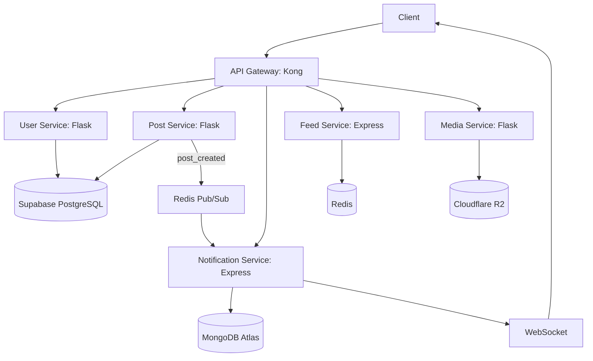
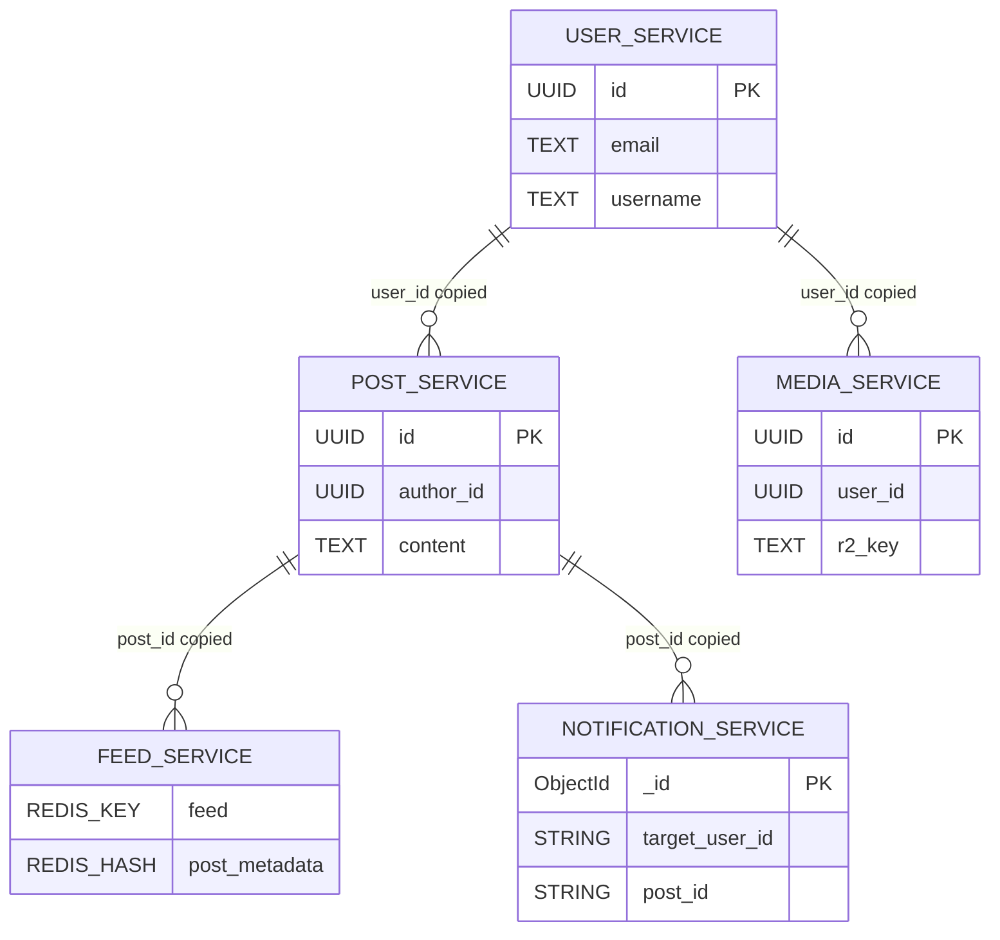

## **Technical Design Document (TDD)**

**Project Name**: Social Media Backend (Microservices)  
**Version**: 1.0  
**Author**: Chan Zhe Xiang  
**Last Updated**: 04/04/2025  
**Tech Stack**: Express (TypeScript), Flask (Python), Kong, Supabase, MongoDB Atlas, Redis, Cloudflare R2

---

## **1. System Architecture**

### **1.1 High-Level Overview**



### **1.2 Component Roles**

| **Component**            | **Responsibilities**                            | **Key Technologies**                         |
| ------------------------ | ----------------------------------------------- | -------------------------------------------- |
| **API Gateway (Kong)**   | Request routing, rate limiting, JWT validation. | Kong, OpenID Connect (Supabase).             |
| **User Service**         | Auth (Supabase JWT), profile management.        | Flask, Supabase Auth.                        |
| **Post Service**         | Post/comment/like CRUD operations.              | Flask, Supabase PostgreSQL.                  |
| **Notification Service** | Real-time alerts via WebSocket.                 | Express + WebSocket, Redis Pub/Sub, MongoDB. |
| **Feed Service**         | Personalized timeline generation.               | Express, Redis (sorted sets).                |
| **Media Service**        | Image/video uploads and CDN delivery.           | Flask, Cloudflare R2.                        |

### **1.3 Data Flow**

#### **Write Path (Example: Creating a Post)**

1. **Client** → `POST /posts` (via Kong).
2. **Kong** → Validates JWT → Routes to **Post Service**.
3. **Post Service** → Saves to Supabase PostgreSQL → Publishes `post_created` to Redis Pub/Sub.
4. **Notification Service** → Listens to Redis → Sends WebSocket alert to followers.

#### **Read Path (Example: Fetching Feed)**

1. **Client** → `GET /feed` (via Kong).
2. **Kong** → Routes to **Feed Service**.
3. **Feed Service** → Checks Redis cache → Falls back to Supabase if cache miss.

### **1.4 Technology Justifications**

| **Choice**              | **Why?**                                    |
| ----------------------- | ------------------------------------------- |
| **Kong**                | Enterprise-grade API-Gateway/rate-limiting. |
| **Supabase PostgreSQL** | Auth + relational data in one free tier.    |
| **Redis Pub/Sub**       | Lightweight real-time events.               |
| **Cloudflare R2**       | Zero egress fees + S3 compatibility.        |

---

## **2. API Specifications**

### **2.1 User Service (Flask)**

**Base Path**: `/users`

#### **2.1.1 Authentication**

| Method | Endpoint         | Description          | Request/Response                                                |
| ------ | ---------------- | -------------------- | --------------------------------------------------------------- |
| POST   | `/auth/register` | Register new user    | [Request](#user-register) / [Response](#user-register-response) |
| POST   | `/auth/login`    | Login user           | [Request](#user-login) / [Response](#user-login-response)       |
| POST   | `/auth/refresh`  | Refresh JWT token    | [Request](#user-refresh) / [Response](#user-refresh-response)   |
| POST   | `/auth/logout`   | Invalidate JWT token | Headers: `Authorization: Bearer <JWT>` → `204 No Content`       |

#### **2.1.2 User Profiles**

| Method | Endpoint     | Description              | Request/Response                                     |
| ------ | ------------ | ------------------------ | ---------------------------------------------------- |
| GET    | `/me`        | Get current user profile | `200 OK`: `{ id, email, username, bio, avatar_url }` |
| PUT    | `/me`        | Update profile           | [Request](#user-update) / `200 OK`: Updated profile  |
| GET    | `/{user_id}` | Get user by ID           | `200 OK`: `{ id, username, bio, follower_count }`    |
| DELETE | `/me`        | Delete account           | `204 No Content`                                     |

---

### **2.2 Post Service (Flask)**

**Base Path**: `/posts`

#### **2.2.1 Posts**

| Method | Endpoint     | Description            | Request/Response                                                      |
| ------ | ------------ | ---------------------- | --------------------------------------------------------------------- |
| POST   | `/`          | Create post            | [Request](#post-create) / `201 Created`: `{ id, content, author_id }` |
| GET    | `/{post_id}` | Get post by ID         | `200 OK`: `{ id, content, author_id, likes_count, comments_count }`   |
| PUT    | `/{post_id}` | Update post            | [Request](#post-update) / `200 OK`: Updated post                      |
| DELETE | `/{post_id}` | Delete post            | `204 No Content`                                                      |
| GET    | `/`          | List posts (paginated) | `200 OK`: `{ posts: [], next_cursor }`                                |

#### **2.2.2 Comments**

| Method | Endpoint                   | Description    | Request/Response                                                      |
| ------ | -------------------------- | -------------- | --------------------------------------------------------------------- |
| POST   | `/{post_id}/comments`      | Add comment    | [Request](#comment-create) / `201 Created`: `{ id, text, author_id }` |
| GET    | `/{post_id}/comments`      | List comments  | `200 OK`: `{ comments: [] }`                                          |
| DELETE | `/{post_id}/comments/{id}` | Delete comment | `204 No Content`                                                      |

#### **2.2.3 Likes**

| Method | Endpoint           | Description          | Request/Response                      |
| ------ | ------------------ | -------------------- | ------------------------------------- |
| POST   | `/{post_id}/likes` | Like a post          | `201 Created`: `{ post_id, user_id }` |
| DELETE | `/{post_id}/likes` | Unlike a post        | `204 No Content`                      |
| GET    | `/{post_id}/likes` | List users who liked | `200 OK`: `{ likes: [] }`             |

---

### **2.3 Notification Service (Express)**

**Base Path**: `/notifications`

#### **2.3.1 WebSocket**

| Endpoint                              | Protocol  | Description                                             |
| ------------------------------------- | --------- | ------------------------------------------------------- |
| `wss://api.example.com/notifications` | WebSocket | Real-time events: `{ type: "like", post_id, actor_id }` |

#### **2.3.2 HTTP API**

| Method | Endpoint     | Description         | Request/Response                  |
| ------ | ------------ | ------------------- | --------------------------------- |
| GET    | `/`          | List notifications  | `200 OK`: `{ notifications: [] }` |
| PUT    | `/{id}/read` | Mark as read        | `204 No Content`                  |
| DELETE | `/{id}`      | Delete notification | `204 No Content`                  |

---

### **2.4 Feed Service (Express)**

**Base Path**: `/feed`

| Method | Endpoint   | Description             | Request/Response                               |
| ------ | ---------- | ----------------------- | ---------------------------------------------- |
| GET    | `/`        | Personalized feed       | `200 OK`: `{ feed: [] }` (sorted by relevance) |
| GET    | `/explore` | Trending posts/hashtags | `200 OK`: `{ trending: [] }`                   |

---

### **2.5 Media Service (Flask)**

**Base Path**: `/media`

| Method | Endpoint     | Description        | Request/Response                        |
| ------ | ------------ | ------------------ | --------------------------------------- |
| POST   | `/upload`    | Upload image/video | `201 Created`: `{ url, width, height }` |
| DELETE | `/{file_id}` | Delete media       | `204 No Content`                        |

---

### **Request/Response Examples**

#### **User Register**

**Request**:

```json
{
    "email": "user@example.com",
    "password": "SecurePassword123!",
    "username": "newuser"
}
```

**Response**:

```json
{
    "id": "user_123",
    "email": "user@example.com",
    "access_token": "<JWT>"
}
```

#### **Post Create**

**Request**:

```json
{
    "content": "Hello world! #firstpost",
    "media_url": "https://r2.com/image1.jpg"
}
```

**Response**:

```json
{
    "id": "post_456",
    "author_id": "user_123",
    "created_at": "2023-11-20T12:00:00Z"
}
```

#### **Comment Create**

**Request**:

```json
{
    "text": "Great post!",
    "author_id": "user_789"
}
```

---

#### **Error Handling**

**Standard Error Response**:

```json
{
    "error": "InvalidRequest",
    "message": "Content cannot be empty",
    "status_code": 400
}
```

---

## **3. Database Design**

### **3.1 Saga in Microservices Design**

A **Saga** is a pattern for managing **distributed transactions** in microservices, where a single business process (e.g., "Create Post + Update Feed") spans multiple services. Since traditional ACID transactions aren't feasible across services, Sagas ensure **eventual consistency** by breaking the transaction into smaller, reversible steps with **compensating actions** for failure recovery.

#### **Why Sagas Are Critical**

1. **No Distributed Transactions**

    - Microservices use independent databases, making traditional `COMMIT`/`ROLLBACK` impossible.
    - Sagas provide an alternative to maintain consistency across services.

2. **Avoid Long-Locking**

    - Holding database locks across services harms scalability and performance.
    - Sagas eliminate cross-service locks by design.

3. **Reliable Failure Handling**

    - If any step fails, compensating transactions (undo actions) restore consistency.
    - Example: "Payment failed → Refund → Restore inventory"

4. **Business Process Coordination**
    - Manages complex workflows (order processing, payment, inventory updates) across services.
    - Ensures all steps complete or compensating actions clean up.

#### **Implementation Approaches**

-   **Choreography**: Event-driven (services react to events)
-   **Orchestration**: Central coordinator manages flow

#### **Key Trade-offs**

✔ Enables distributed transactions without ACID  
✔ Improves scalability by avoiding locks  
❌ Adds complexity (must design compensation logic)  
❌ Only eventual consistency (not immediate)

Sagas are essential for maintaining data integrity in distributed systems while preserving microservice autonomy.

---

### **3.2 Saga Orchestration vs Choreography**

| **Feature**          | **Orchestration**                            | **Choreography**                                 |
| -------------------- | -------------------------------------------- | ------------------------------------------------ |
| **Control**          | Centralized (orchestrator manages steps)     | Decentralized (services react to events)         |
| **Complexity**       | ✅ Handles **complex workflows** well        | ✅ Better for **simple, reactive flows**         |
| **Visibility**       | ✅ High (single point of tracking)           | ❌ Low (requires distributed tracing)            |
| **Coupling**         | ❌ Tighter (orchestrator knows all services) | ✅ Looser (services only publish/consume events) |
| **Fault Tolerance**  | ❌ Single point of failure (orchestrator)    | ✅ Resilient but ❌ harder to debug failures     |
| **Event Storm Risk** | ✅ None (controlled flow)                    | ❌ High (unintended event chains)                |
| **Scalability**      | ❌ Limited (orchestrator bottleneck risk)    | ✅ Better (no central bottleneck)                |

**Decision**: Use **Orchestrator Pattern** with a dedicated **Saga Orchestrator Service** (Express.js) for easier management of transactions and easier debugging.

---

### **3.3 Database Schemas**

#### **3.3.1 User Service (Supabase PostgreSQL)**

```sql
-- Users (auth managed by Supabase)
CREATE TABLE users (
  id UUID PRIMARY KEY DEFAULT gen_random_uuid(),
  email TEXT UNIQUE NOT NULL,
  username TEXT UNIQUE NOT NULL,
  avatar_url TEXT,
  created_at TIMESTAMPTZ DEFAULT NOW()
);

-- Followers (no foreign keys to other services)
CREATE TABLE followers (
  follower_id UUID NOT NULL,  -- Local user ID
  followee_id UUID NOT NULL,  -- Local user ID
  created_at TIMESTAMPTZ DEFAULT NOW(),
  PRIMARY KEY (follower_id, followee_id)
);

-- Saga support for user deletions
CREATE TABLE user_saga_log (
  saga_id UUID PRIMARY KEY,
  user_id UUID NOT NULL,
  compensation_status VARCHAR(20) NOT NULL CHECK (compensation_status IN ('PENDING', 'COMPLETED', 'FAILED'))
);
```

---

#### **3.3.2 Post Service (Supabase PostgreSQL)**

```sql
-- Posts (denormalized author_id)
CREATE TABLE posts (
  id UUID PRIMARY KEY DEFAULT gen_random_uuid(),
  author_id UUID NOT NULL,  -- Copy from User Service
  content TEXT NOT NULL,
  status VARCHAR(20) NOT NULL DEFAULT 'PUBLISHED' CHECK (status IN ('DRAFT', 'PUBLISHED', 'DELETED')),
  created_at TIMESTAMPTZ DEFAULT NOW()
);

-- Comments (denormalized author_id)
CREATE TABLE comments (
  id UUID PRIMARY KEY DEFAULT gen_random_uuid(),
  post_id UUID NOT NULL REFERENCES posts(id) ON DELETE CASCADE,
  author_id UUID NOT NULL,  -- Copy from User Service
  text TEXT NOT NULL,
  created_at TIMESTAMPTZ DEFAULT NOW()
);

-- Likes (no foreign key to users)
CREATE TABLE likes (
  post_id UUID NOT NULL REFERENCES posts(id) ON DELETE CASCADE,
  user_id UUID NOT NULL,  -- Copy from User Service
  created_at TIMESTAMPTZ DEFAULT NOW(),
  PRIMARY KEY (post_id, user_id)
);

-- Saga log for post creation/deletion
CREATE TABLE post_saga_log (
  saga_id UUID PRIMARY KEY,
  post_id UUID NOT NULL,
  current_step VARCHAR(50) NOT NULL,  -- E.g., 'FEED_UPDATED'
  compensation_data JSONB  -- Stores data needed for rollback
);
```

---

#### **3.3.3 Notification Service (MongoDB Atlas)**

```javascript
// Notifications
{
  _id: ObjectId,
  target_user_id: String,  // From User Service
  actor_user_id: String,   // From User Service
  post_id: String,         // From Post Service (optional)
  type: String,            // 'like', 'comment', 'follow'
  is_read: Boolean,
  created_at: ISODate
}

// Saga state
{
  saga_id: String,
  notification_ids: [String],  // For batch compensation
  status: String  // 'PENDING', 'COMPENSATED'
}
```

---

#### **3.3.4 Feed Service (Redis)**

```bash
# User feed (Sorted Set)
# Key: user:{user_id}:feed
# Value: ZADD timestamp post_id
# Example:
ZADD user:123:feed 1672531200 post_789

# Post metadata (Hash)
# Key: post:{post_id}
# Value:
HSET post:789 author_id 456 content "Hello world!" likes 5

# Saga tracking (String)
# Key: saga:{saga_id}
# Value:
SET saga:abc123 "POST_CREATION:FEED_PENDING"
```

---

#### **3.3.5 Media Service (Cloudflare R2 + PostgreSQL Metadata)**

```sql
-- Media metadata (Supabase PostgreSQL)
CREATE TABLE media (
  id UUID PRIMARY KEY DEFAULT gen_random_uuid(),
  user_id UUID NOT NULL,  -- Copy from User Service
  r2_key TEXT NOT NULL,   // E.g., 'posts/789/image.jpg'
  mime_type VARCHAR(100) NOT NULL,
  created_at TIMESTAMPTZ DEFAULT NOW()
);

-- Saga log for media deletions
CREATE TABLE media_saga_log (
  saga_id UUID PRIMARY KEY,
  media_id UUID NOT NULL,
  r2_key TEXT NOT NULL  // Needed for compensation
);
```

---

#### **3.3.6 Saga Orchestrator Service (PostgreSQL)**

```sql
-- Orchestrator state
CREATE TABLE sagas (
  id UUID PRIMARY KEY,
  type VARCHAR(50) NOT NULL,  // E.g., 'POST_CREATION'
  status VARCHAR(20) NOT NULL,
  steps JSONB NOT NULL  // {'POST_CREATED': true, 'FEED_UPDATED': false}
);

-- Event outbox (for retries)
CREATE TABLE event_outbox (
  id UUID PRIMARY KEY,
  saga_id UUID NOT NULL REFERENCES sagas(id),
  event_type VARCHAR(50) NOT NULL,
  payload JSONB NOT NULL,
  retry_count INTEGER DEFAULT 0
);
```

---

#### **3.3.7 Schema Relationships Diagram**



---

### **3.4 Key Design Notes**

1. **No Foreign Keys Across Services**:

    - All IDs are **copies** (eventually consistent via sagas).
    - Example: `post.author_id` is a copy of `user.id`.

2. **Saga Data Flow**:

    - **Post Creation**:
        1. Reserve Post → Reserve Feed Slot → Commit Both.
        2. If Feed fails: Delete Post (compensation).
    - **User Deletion**:
        1. Mark user as disabled → Delete posts/media (async).

3. **Redis Usage**:
    - **Feed Service**: Sorted Sets for timelines, Hashes for post metadata.
    - **Saga Locks**: `SETNX saga_lock:{id} 1` for concurrent control.

---

## **3.5 Tools & Libraries**

1. **Saga Orchestrator**:
    - Express.js + TypeScript.
    - PostgreSQL for saga state tracking.
2. **Event Bus**: Redis Pub/Sub (for async retries).
3. **Idempotency**: Unique `saga_id` per transaction.
